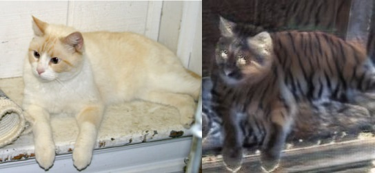
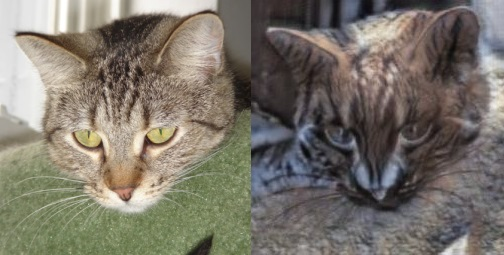
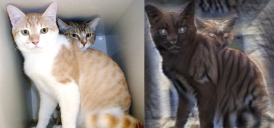

## Cat2Tiger CycleGAN бот
### Проект DLS осеннего семестра 2023 года

### Идея бота

Бот получает изображение кошки и выдает изображение, стилизованное под тигра.

### Архитектура модели

CycleGAN-архитектура модели взята из [статьи](https://arxiv.org/abs/1703.10593):

1. Мы работаем с изображениями 256х256.

2. Генераторы содержат 3 сверточных слоя и 9 ResNet блоков.

3. Финальный сверточный слой дискриминаторов на выходе имеет не число, а тензор 70х70 (т.е. содержит оценку для разных перекрывающихся частей изображения). 

### Датасеты

Обучение проводилось на kaggle-датасетах для [кошек](https://www.kaggle.com/datasets/shaunthesheep/microsoft-catsvsdogs-dataset) и [тигров](https://www.kaggle.com/datasets/quadeer15sh/amur-tiger-reidentification).

Из датасетов исключены слишком маленькие изображения (меньше 10 Кбайт). Также отфильтрованы некачественные фото тигров (оригинальный датасет собирался из кадров разных видео).


### Алгоритм обучения

1. Из датасетов берутся два изображения (один кот и один тигр).

2. Генерируется фейковый тигр (кот после генератора cat2tiger) и фейковый кот (тигр после генератора tiger2cat).

3. Дискриминатор котов обучается на паре (кот, фейковый кот), дискриминатор тигров обучается на паре (тигр, фейковый тигр). Функция потерь MSE.

4. Фейковый тигр пропускается через tiger2cat и получается кот (будем называть его цикличным). Так же получаем цикличного тигра.

5. Обучение генераторов заключается попытке обмануть дискриминатор фейковой картинкой (функция потерь MSE) и минимизации разницы между оригинальным и цикличным фото (функция потерь L1).

Чтобы дать фору генератору, для обучения дискриминатора изображения поступают через буфер.

Обучение проводилось в Google Colab ([notebook](https://colab.research.google.com/drive/1EOWdkKSqKqkYBGPWw28px5kJTz-ggIGK?usp=sharing)).

### Установка и использование

Бот написан с помощью модуля [aiogram](https://docs.aiogram.dev).

Необходимые модули можно подгрузить с помощью 

```
pip install -r requirements.txt
```

Перед запуском нужно положить токен бота в переменную среды TG_BOT_TOKEN.

```
export TG_BOT_TOKEN="XXXXXXXXXXXXXXXXXXXXXXXXXXXXXXXXXXXXXXXXX"
python app.py
```

### Примеры работы





